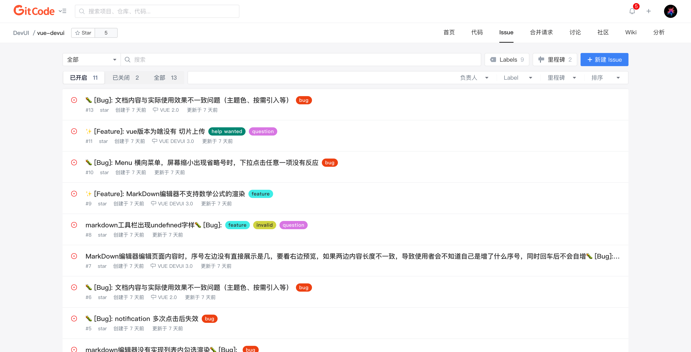

Issue 可以用于跟踪和管理项目中的问题、bug、任务和改进请求，它是开发者在 GitCode 上进行协作和解决问题的关键部分。

## 创建新的 Issue

1. 访问你的 GitCode 项目
2. 在项目导航栏中，点击 "Issue" 选项卡
3. 单击「+新建 Issue」按钮
4. 填写 Issue 标题和描述，确保描述足够清晰，以便其他人能够理解问题或任务
5. 单击「新建」按钮，创建 Issue

## Issue 标题和描述

- 标题应该简洁但具体，描述问题的核心
- 在描述中，提供尽可能多的上下文，包括问题的复现步骤、环境信息等

## 分配和标签

- 分配 Issue 给相关的团队成员，以明确责任
- 使用 Label 来分类和标记 Issue，使其更容易被发现和管理

## 里程碑

- 使用里程碑来将 Issue 与特定版本或计划相关联，以追踪进度
- 里程碑可以帮助你组织和优先处理问题

## 评论和讨论

- 在 Issue 下方的评论区域，团队成员和贡献者可以进行讨论和提供反馈
- 使用 @ 提及来引起特定人员的注意
- 鼓励建设性的讨论，以便更好地解决问题

## 关闭 Issue

- 当问题得到解决或任务完成时，可以关闭 Issue
- 已经关闭的 Issue 也可以重新打开

## 搜索和筛选 Issue

- 使用 GitCode 的搜索功能来查找特定 Issue
- 使用筛选器和关键词来缩小搜索范围，以找到相关的问题

## 提醒和通知

- 使用 @ 提及来提醒特定人员参与讨论或查看 Issue
- 配置通知设置，以确保你及时了解与你相关的 Issue 的更新

通过合理使用 GitCode Issue，你可以更好地组织、跟踪和解决项目中的问题和任务。