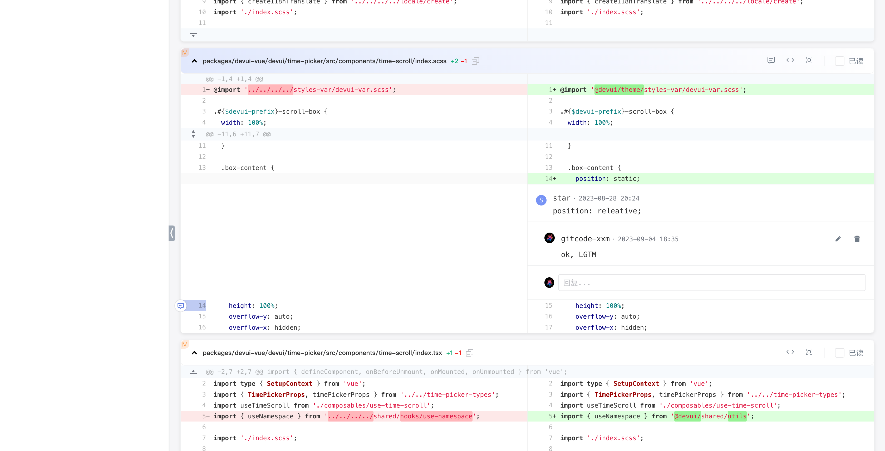

合并请求代码评审是一种协同工作方法，它允许团队成员审查、讨论和提供反馈，以确保代码的质量、可读性和安全性。通过代码评审，团队成员可以：

- **审查代码质量**：检查代码是否符合项目的标准和最佳实践
- **提供反馈**：发现潜在问题并提供改进建议
- **验证功能**：确保新功能或更改的正确性
- **维护可读性**：确保代码易于理解和维护

### 如何进行代码评审

下面是进行代码评审的基本步骤：

1. 打开合并请求：进入 GitCode 项目，点击“合并请求”选项卡，选择要审查的合并请求
2. 查看更改差异：在合并请求页面的“文件改动”选项卡下，查看代码更改的差异
3. 提出评论：在代码更改上，你可以单击行号或选中文本，然后单击 "+ 提交评论" 按钮来提出评论
4. 提供建议和反馈：在评论中，可以提供建议、问题和反馈，以改进代码
5. 讨论和解决问题：作者和评审人可以在评论中进行讨论，以解决问题或澄清疑虑

### 评审过程中的常见操作

在进行代码评审时，你可以执行以下常见操作：

#### 评论和讨论

- 评论代码行或特定代码块，以提供反馈和建议
- 使用 @ 提及其他团队成员，以引起他们的注意并邀请他们参与评审和讨论
- 讨论在评审期间提出的问题，以确保问题得到解决

#### 检查更改差异

- 查看代码更改的差异，了解哪些代码已添加、删除或修改
- 使用代码对比视图来比较不同版本之间的代码更改

#### 提出建议

- 提供具体的建议，例如如何改进代码、解决问题或优化性能
- 在评论中使用 Markdown 语法来使建议更具可读性

#### 批准或拒绝合并请求

- 审核代码并根据评审的结果批准或拒绝合并请求
- 提供清晰的审批或拒绝理由，以便作者了解决策的原因

### 评审人和作者角色

- **作者**：合并请求的创建者，负责编写和提交代码更改，作者需要积极响应评审的反馈
- **评审人**：负责审查和评估代码更改的团队成员，评审人提供反馈、建议和决策，以确保代码质量

### 最佳实践

- **积极参与**：作者和评审人都应积极参与评审过程，确保评审不会拖延
- **清晰的评论**：提供清晰和有建设性的评论，避免使用模糊或不具体的语言
- **遵循项目规范**：确保代码符合项目的规范、最佳实践和编码准则
- **及时响应**：作者应尽快响应评审人的反馈和建议，并在需要时进行更改
