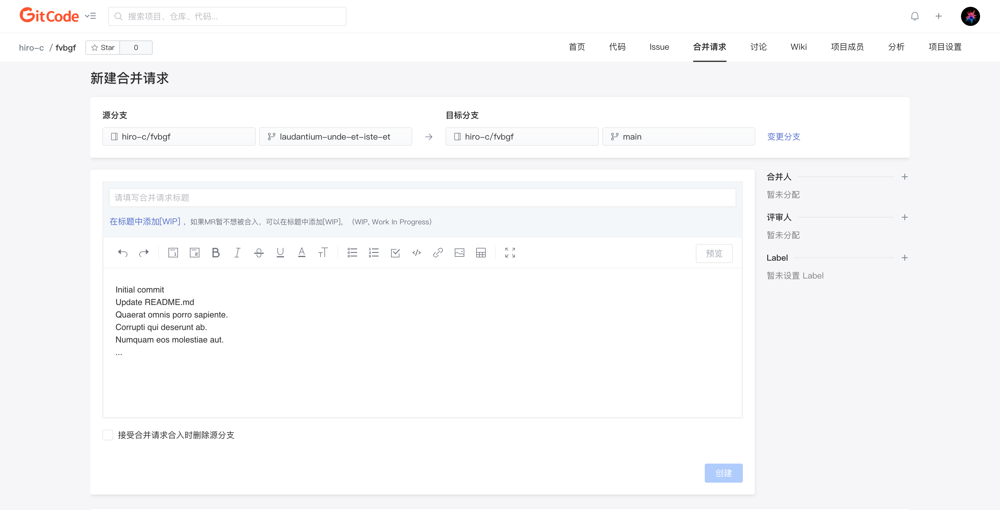

合并请求是一个关键的协作工具，用于将代码更改合并到项目的主分支。以下是创建合并请求的常见步骤：

1. 在 GitCode 项目页面上，点击“合并请求”选项卡
2. 单击「+新建合并请求」按钮
3. 选择要合并的分支和目标分支。通常，你将选择自己的分支（`feature` 分支）和主分支（通常是 `main` 或 `master` 分支）
4. 添加标题和描述，描述你的代码更改的目的和内容
5. 单击「创建」按钮，创建合并请求

### 分支选择

在创建合并请求时，确保选择正确的分支。通常，你将从你的功能分支（特性分支）向主分支或其他目标分支创建合并请求。

### 合并请求的标题和描述

- **标题**：标题应该简洁明了，描述你的合并请求的目的。好的标题可以让其他人快速理解这个合并请求的意图
- **描述**：在描述中，提供更多的上下文，解释为什么进行这些更改以及这些更改如何影响项目。清晰的描述可以帮助审阅者更好地理解你的工作

### 分配合并人

你可以为合并请求分配合并人，合并人将负责处理该合并请求，包括合入或者关闭等。

### 分配评审人

你可以为合并请求分配审阅者，他们将负责审查你的代码更改。审阅者可以提供反馈、建议，通过或拒绝合并请求。

### 标签和里程碑

如果你的项目使用标签和里程碑来组织和跟踪工作，确保为合并请求添加适当的标签和将其关联到适当的里程碑。