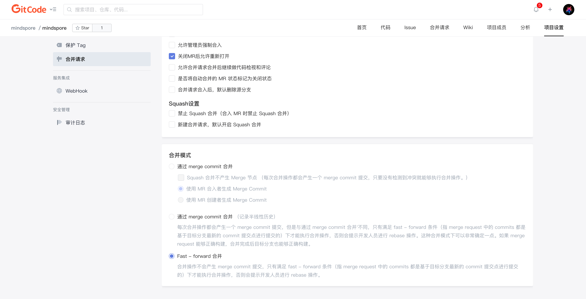

快进合并是一种合并代码更改的方法，其中将要合并的分支的更改直接应用到目标分支上，而不创建新的合并提交。这种合并适用于以下情况：

- 没有代码冲突：目标分支和要合并的分支之间没有代码冲突
- 简单且线性的合并：分支的提交历史非常简单且线性，没有合并提交

通过合并请求的快进合并功能可以快进将代码更改合并到目标分支，可以高效地管理代码合并。

### 如何执行快进合并

执行快进合并非常简单：

1. 确保开启了快进合并：进入 GitCode 项目，点击“项目设置”选项卡，并在“合并请求-合并模式”中启用了“Fast-forward 合井”
2. 打开要合并的合并请求：进入 GitCode 项目，点击“合并请求”选项卡，选择要快进合并的合并请求
3. 确认合并条件：确保合并请求满足快进合并的条件，即目标分支和合并请求分支之间没有冲突，且提交历史是线性的
4. 单击「合入」按钮：在合并请求“讨论”选项卡中单击「合入」按钮
5. 合并完成：一旦合并完成，代码更改将直接应用到目标分支上，没有新的合并提交

### 最佳实践

以下是使用 GitCode 合并请求快进合并功能的最佳实践：

- **确保无冲突**：在执行快进合并之前，确保目标分支和要合并的分支之间没有代码冲突
- **维护线性提交历史**：尽量保持分支的提交历史线性，避免不必要的合并提交
- **使用快进合并来加速流程**：对于简单的合并请求，特别是在持续集成/持续交付 (CI/CD) 流程中，使用快进合并来加速代码合并