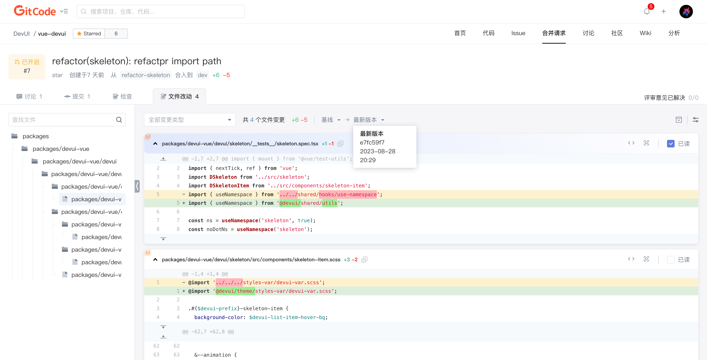

合并请求版本是合并请求中的不同提交状态的快照。如果在审查期间需要进行更改，你可以在你自己的分支中继续提交代码，每次提交都会创建一个新的版本。这使你可以：

1. **跟踪代码更改历史**：查看代码在合并请求中如何演变，从而更好地理解代码的发展过程
2. **比较不同版本**：轻松地比较合并请求的不同版本，以查看哪些代码已添加、删除或修改

## 如何查看合并请求版本？

1. 打开合并请求：首先，打开你项目的“合并请求”选项卡，在合并请求列表中点击并进入查看合并请求详情的页面
2. 选择“文件改动”选项卡：在合并请求页面，选择“文件改动”选项卡，以查看与该合并请求相关的文件更改
3. 选择版本：在“文件改动”页面的上方，你会看到一个下拉菜单，显示当前版本和之前的版本，选择要查看的版本
4. 比较版本：一旦选择了版本，你将看到当前版本和所选版本之间的差异，添加的行会以绿色显示，删除的行以红色显示
5. 浏览版本差异：你可以通过向下滚动页面来浏览文件中的所有更改，每个版本之间的差异都以清晰的方式显示出来
6. 选择其他文件：使用左侧的文件列表，你可以选择查看其他文件的版本差异