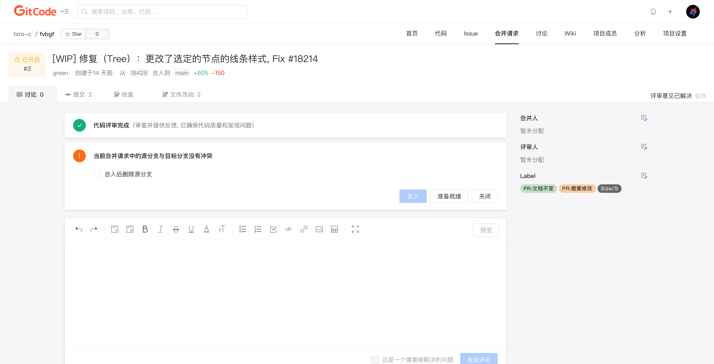

合并请求草稿是一个处于未提交状态的合并请求，它允许你在创建合并请求时将其标记为草稿，以便你可以在创建后进行进一步的工作、编辑和讨论，而不会立即触发自动合并。这对于在合并请求尚未完全准备好时与团队合作或在进行初步工作时非常有用。

### 如何创建合并请求草稿

创建合并请求草稿与创建常规合并请求类似：

1. 打开你的 GitCode 项目
2. 单击“合并请求”选项卡，然后点击「+新建合并请求」按钮
3. 在分支对比页面，选择要合并的源分支和目标分支
4. 在创建合并请求页面中，点击「在标题中添加[WIP]」，在标题中添加 WIP 标记
5. 填写合并请求的标题和描述，然后单击「创建」按钮

这样，你就创建了一个草稿合并请求

### 编辑和讨论合并请求草稿

一旦合并请求草稿创建成功，你可以进行以下操作：

- **编辑**：单击合并请求标题，就可以进入标题的编辑模式，编辑合并请求的标题
- **评论**：在合并请求页面下方的评论区域中，你和团队成员可以讨论合并请求的细节、提出建议和提供反馈
- **更新代码**：根据团队的反馈，你可以更新分支中的代码，合并请求草稿会自动反映这些更改
- **合并人和评审人**：可以为合并请求草稿添加合并人和评审人

### 将合并请求从草稿状态转为正式状态

当你认为合并请求已经准备好并通过审查时，可以将其从草稿状态转为正式状态以进行合并。执行以下步骤：

1. 打开合并请求
2. 在合并请求页面的“讨论”选项卡下方，点击「准备就绪」按钮
3. 确认转为正式状态后，你的合并请求将可以被合并

### 最佳实践

- **使用草稿进行初步工作**：创建草稿合并请求是进行初步工作、概念验证和讨论的好方法。这样，你可以与团队一起制定最佳的解决方案
- **清晰的标题和描述**：即使是草稿，也要确保合并请求的标题和描述清晰明了，以便其他人能够理解你的意图
- **定期更新**：根据讨论和反馈，定期更新合并请求，使其保持与项目的最新状态一致
- **审查和讨论**：积极参与审查和讨论，确保团队对合并请求的状态和进度有清晰的认识

通过合并请求草稿功能，GitCode 提供了更灵活的方式来协作、讨论和管理代码的合并过程。这使团队能够更好地规划和控制代码的变更，同时确保代码的质量和稳定性。