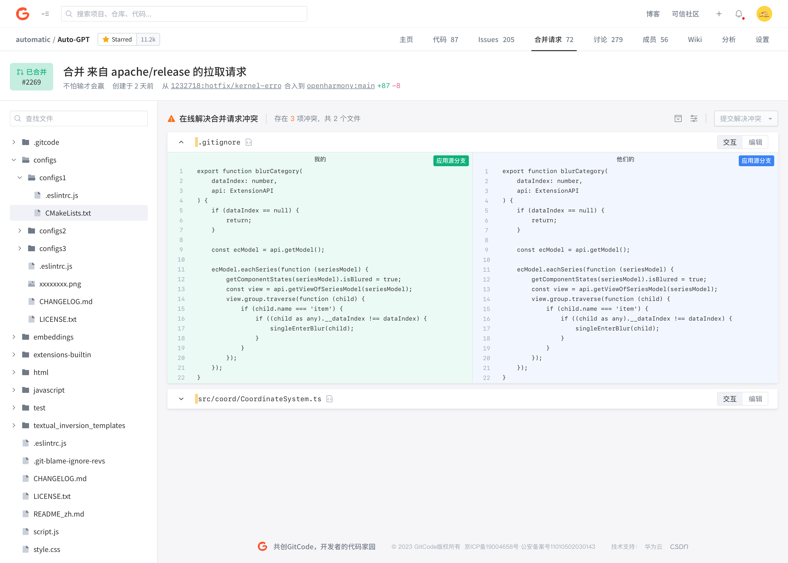

合并请求冲突是指在合并分支时，系统无法自动确定如何合并代码更改的情况。这通常发生在以下情况下：

- 两个分支同时修改了相同的文件的相同部分
- 合并请求的目标分支已经包含了不在源分支中的更改

解决冲突将允许团队协作解决冲突，确保合并请求成功合并到目标分支。

### 解决冲突的基本步骤

当合并请求出现冲突时，你可以按照以下基本步骤来解决它

1. **打开合并请求**：进入 GitCode 项目，点击“合并请求”选项卡，选择包含冲突的合并请求
2. **查看冲突**：在合并请求页面的“讨论”选项卡下，你将存在冲突的提示。单击「在线解决冲突」按钮以查看冲突
3. **解决冲突**：根据需要编辑代码，以解决冲突，你可以使用自动解决工具或手动编辑代码
4. **提交更改**：一旦解决冲突，你可以提交更改以保存代码
5. **完成合并**：完成合并请求，将解决冲突后的代码合并到目标分支

### 使用合并冲突解决工具

GitCode 提供了内置的合并冲突解决工具，可帮助简化解决冲突的过程：

- 点击「在线解决冲突」按钮后，你将看到一个带有解决冲突标记的文件
- 你可以在冲突标记之间进行选择并标记文件中的冲突为已解决
- 点击「提交解决冲突」按钮来提交解决冲突后的更改
- 最后，完成合并请求，将解决冲突后的代码合并到目标分支

### 手动解决冲突

如果你需要更精细的控制或自定义解决方案，你可以手动解决冲突：

- 手动编辑文件，删除或修改冲突部分
- 删除冲突标记（`<<<<<<<`，`=======`，`>>>>>>>`）。
- 提交更改

### 最佳实践

- **及时处理冲突**：尽早处理合并请求中的冲突，以避免延迟合并和代码库的混乱
- **使用自动解决工具**：如果可能的话，使用内置的冲突解决工具来简化流程
- **清晰的提交消息**：在解决冲突后，使用清晰、描述性的提交消息来说明你的更改

通过了解如何解决合并请求中的冲突，你可以更有效地协作和管理代码的合并，确保项目的稳定性和质量。