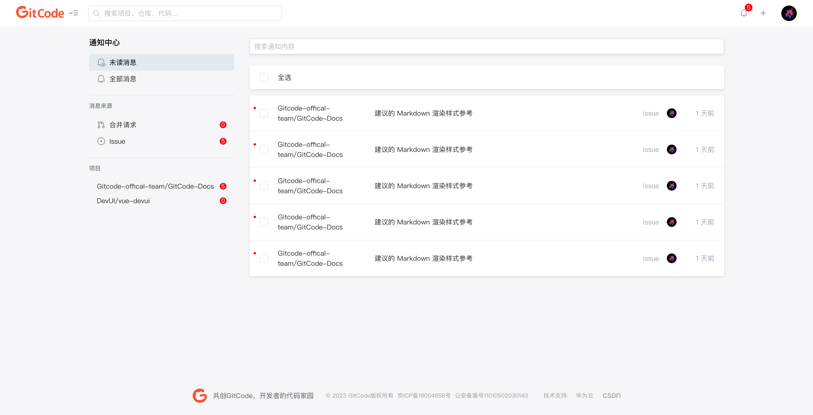

GitCode 通知可向用户提供在其 GitCode 上活动的实时信息。这些通知可以帮助用户及时了解有关项目、issue、合并请求、讨论、团队协作等方面的重要信息。

## 类型的通知

GitCode 通知分为多种类型，包括但不限于以下几种：

1. **提交和合并请求通知**：当你的提交被合并、评论或有新的合并请求时，你会收到通知。这有助于你了解项目的最新变化。
2. **Issue 和讨论通知**：如果你参与的问题或讨论有新的评论、变更状态或分配给你，你会收到通知。这有助于你及时回应用户或团队成员的问题。
3. **团队协作通知**：当你被邀请加入或移出组织、被指派任务或在团队中有其他活动时，你会收到通知。这有助于组织成员了解其角色和职责。
4. **项目活动通知**：你可以订阅特定项目的通知，以便及时了解该项目的活动，包括新的提交、问题和合并请求等。

## 通知渠道

GitCode 通知可以通过多种渠道进行传递，以确保用户及时获取信息：

1. **网站通知**：你可以在 GitCode 网站上的通知中心查看和管理通知。这是最常见的查看通知的方式。
2. **电子邮件通知**：GitCode 会将通知通过你已认证的电子邮件发送给你，以便你在不登录 GitCode 的情况下也能了解到重要信息。

## 通知设置

GitCode 允许用户自定义其通知设置，以满足其个人需求和偏好。你可以：

- **选择通知类型**：根据你的需求选择要接收的通知类型，以避免被不必要的信息淹没
- **自定义通知频率**：设置通知的频率，例如立即通知或每日摘要，以适应你个人的时间安排
- **管理通知渠道**：选择你希望通过哪种渠道接收通知，例如站内通知、电子邮件