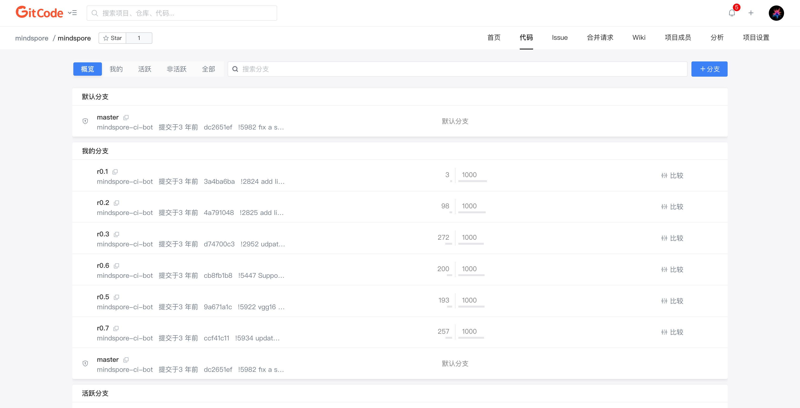

分支功能是一种用于创建、编辑和测试代码更改的方式，而不会影响主要代码库，允许开发者在不影响主要代码的情况下创建、编辑和测试新功能。

分支是存储库的副本，允许开发者在独立的环境中进行工作，并在完成后将更改合并回主分支。无论你是个人开发者还是团队成员，GitCode 的分支功能都提供了强大的代码管理和协作工具，以帮助你更好地构建和维护软件项目。这使得团队能够更轻松地协作、构建新功能和解决问题。

分支功能提供了以下核心功能：

- **独立开发**：创建分支允许开发者在独立的环境中进行工作，不影响主要代码
- **多分支协作**：多个开发者可以同时创建和编辑分支，然后将更改合并回主分支
- **版本控制**：分支允许记录和跟踪不同功能或修复的更改历史
- **分支管理**：GitCode 提供了工具来查看、比较和管理存储库中的所有分支

### 创建分支

1. **登录 GitCode**：首先，确保你已登录到 GitCode 帐户
2. **选择项目**：进入要创建分支的项目页面
3. **点击”分支“**：在项目页面的顶部，点击”分支“按钮并进入分支列表页，点击页面右上角的「+分支」按钮
4. **选择从哪个分支创建**：在弹出的对话框中，选择要从哪个现有的分支创建新的分支
5. **输入分支名称**：输入新分支的名称，也可以填写该新建分支的描述信息（可选）
6. **创建新分支"**：点击「确认」按钮来创建新分支

### 切换分支

1. **点击代码"**：在项目页面的顶部，点击”代码“选项卡
2. **选择目标分支**：在页面左侧目录树的上方，点击默认分支名称并在下拉菜单中选择要切换到的分支
3. **查看分支内容**：在代码页你就可以查看新分支的代码内容

### 合并分支

分支合并功能允许你将不同分支的代码更改合并到主分支或其他分支，实现协作开发和代码管理，关于创建合并请求的更多信息请查看[创建合并请求](../合并请求/创建合并请求.md)

### 最佳实践

以下是使用 GitCode 分支功能的最佳实践：

- 使用明确的分支名称，以便更好地理解分支的目的
- 定期合并主分支到你的分支，以保持最新的代码
- 进行代码审查，以确保合并的更改质量
- 使用分支来独立开发功能、修复问题和进行实验性工作

通过分支功能，你可以更好地管理和协作开发项目，提高代码质量和团队协作的效率。