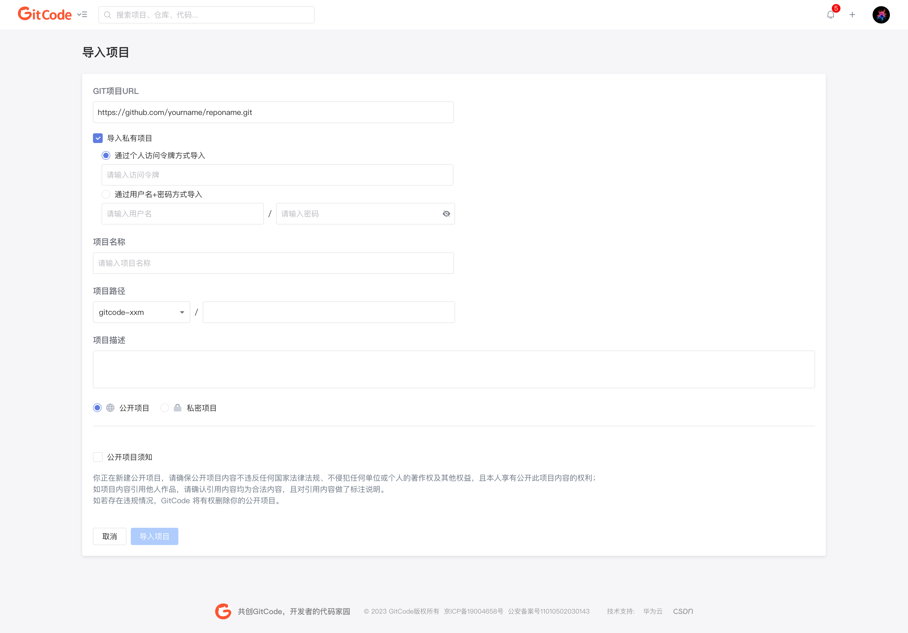

GitCode 提供了通过 URL 导入项目的功能，使你能够轻松将外部存储库导入到 GitCode 中并进行进一步的管理、协作和版本控制。无论你的项目源代码托管在其他平台还是你自己的服务器上，GitCode 的导入功能都能帮助你将其无缝地迁移到 GitCode 上。

URL 导入项目功能可以帮助你：

- **迁移项目**：将外部或现有项目无缝迁移到 GitCode 上，以便更好地管理和协作
- **利用 GitCode 功能**：利用 GitCode 的版本控制、问题跟踪、合并请求等功能来增强项目管理
- **跨平台合作**：允许不同平台上的开发者协作，使项目更具灵活性和可扩展性

### 通过 URL 导入项目功能

要使用通过 URL 导入项目功能，按照以下步骤操作：

1. **登录 GitCode**：首先，确保你已登录到 GitCode 帐户
2. **点击“导入项目(RUL)”**：在 GitCode 的导航栏中，点击「导入项目(URL)」按钮
3. **粘贴存储库 URL**：在“GIT项目URL”栏中，粘贴外部存储库或 Git 存储库的 URL
4. **私有项目设置（可选）**：如果导入的项目是一个私有项目，则还需要提供该项目在源托管平台的凭证（支持个人访问令牌(Token) 或 用户名+密码 两种方式）
5. **选择项目所属帐户**：选择要将存储库导入到的 GitCode 帐户/组织
6. **配置导入选项**：根据你的需求配置导入选项，例如项目名称、路径描述、是否公开等
7. **点击“导入项目“**：点击「导入项目」按钮开始导入项目
8. **等待导入完成**：GitCode 将开始导入项目，你可以在导入进度页面上查看导入进度

### 最佳实践

以下是使用通过 URL 导入项目功能的最佳实践：

- 在导入项目前，确保外部存储库的 URL 是公开可访问的（私有项目则需要提前准备对应的凭证）
- 仔细配置导入选项，以确保导入过程符合你的项目需求
- 在导入后，定期同步和更新导入的存储库，以确保与外部项目保持同步

通过 URL 导入项目功能，你可以更好地管理和协作外部项目，有助于项目的扩展和跨平台合作。