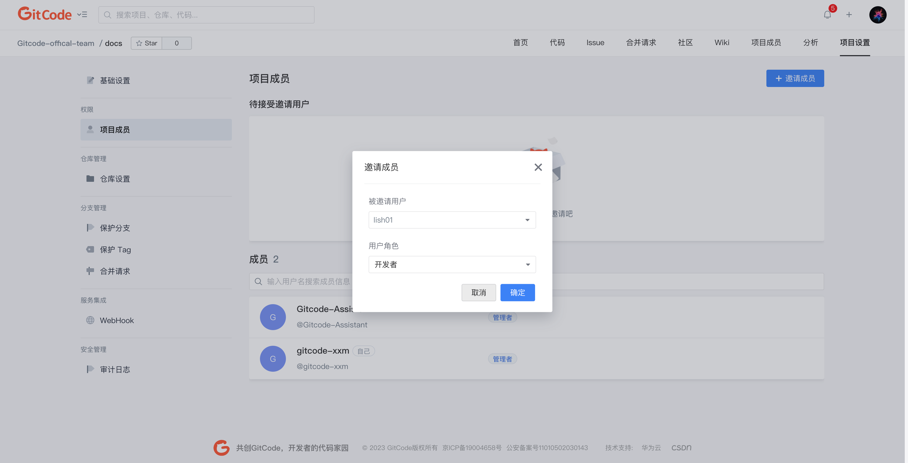

GitCode 提供较为简单的成员管理功能，允许项目和组织管理员有效地管理团队成员的权限、合作方式和访问控制。

- **项目成员**是与特定项目关联的 GitCode 用户，他们可以协作、提交更改、提出问题和创建合并请求
- **组织成员**是与 GitCode 组织关联的用户，他们可以访问组织中的所有项目，并根据其分配的权限进行操作

## 成员角色及权限

在 GitCode 中，成员分为以下三类角色：

1. **管理员**，组织或项目的管理员，对项目或组织有全部的控制权限，包括删除项目或组织、更改项目或组织基本信息、添加或删除其它成员等
2. **开发者**，组织或项目的开发者，允许其查看内容并提交更改，但不允许删除项目
3. **浏览者**，组织或项目的浏览者，允许其查看项目或组织内容，但不允许提交更改

> 注：目前暂不支持项目直接添加 `管理员` 权限的用户，其中：
>
> 1. 个人用户的项目不支持邀请其它用户成为管理员
> 2. 组织项目只支持从组织继承管理员

### 添加项目成员

1. **进入项目**：进入你要添加项目成员的 GitCode 项目
2. **点击项目设置**：在项目页面的右上角，点击“项目设置”选项卡
3. **选择“成员管理”**：在左侧导航栏中，选择“成员管理”
4. **点击邀请成员**：在项目成员页的右上角，点击「+邀请成员」按钮
5. **输入用户名或电子邮件地址**：在弹出的对话框中，输入要添加的用户的 GitCode 用户名或电子邮件地址
6. **选择用户角色**：为该用户选择适当的用户角色，如开发者或浏览者
7. **点击确定**：点击「确定」按钮并向用户设置的默认邮箱发送邀请链接
8. **用户接受邀请**： 用户可以通过邮箱中的邀请链接来接受邀请，再接受邀请之后用户即可作为成员加入项目，并赋予对应的用户角色权限

#### 添加组织成员

1. **进入组织**：进入你要添加组织成员的 GitCode 组织
2. **点击组织设置**：在组织页面的左侧导航栏中，点击“组织设置”选项卡
3. **点击“成员管理”**：：在左侧导航栏中，选择“成员管理”
4. **点击邀请成员**：在项目成员页的右上角，点击「+邀请成员」按钮
5. **输入用户名或电子邮件地址**：在弹出的对话框中，输入要添加的用户的 GitCode 用户名或电子邮件地址
6. **选择用户角色**：为该用户选择适当的权限级别，如管理员、开发者或浏览者
7. **点击确定**：点击「确定」按钮并向用户设置的默认邮箱发送邀请链接
8. **用户接受邀请**： 用户可以通过邮箱中的邀请链接来接受邀请，再接受邀请之后用户即可作为成员加入组织，并赋予对应的用户角色权限

