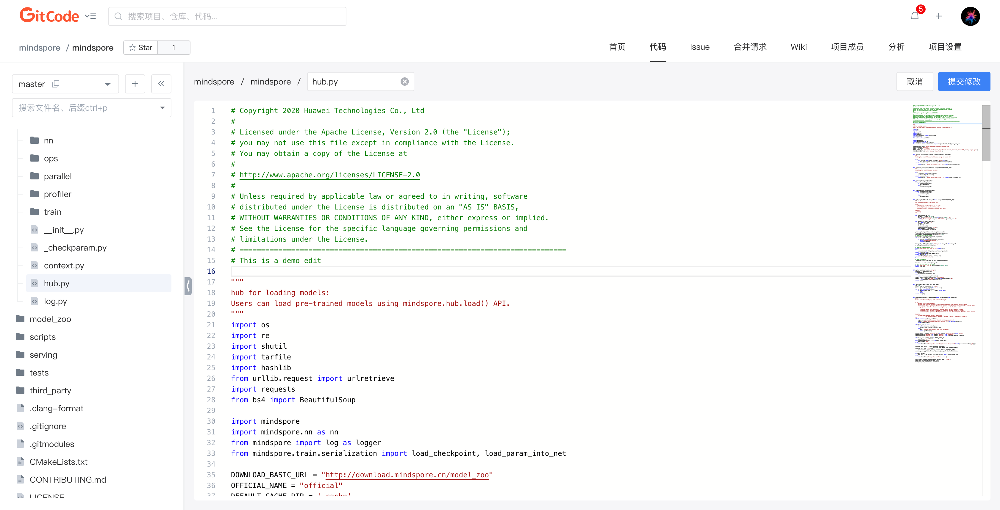

代码编辑是一个在线编辑文件的工具，允许开发者直接在浏览器中编辑项目 Git 仓中的文件，无需克隆或下载整个项目。这个功能使得快速修复错误、添加新特性或进行小型更改变得非常容易。

### 编辑文件

使用代码编辑功能非常简单：

1. **进入文件**：在 GitCode 项目中，导航到要编辑的文件
2. **点击编辑按钮**：在文件的右上角，点击最右侧的「编辑」图标
3. **进行更改**：在编辑模式下，你可以直接编辑文件，你可以添加、删除或修改文本
4. **提交更改**：完成编辑后，点击右上角的「提交修改」按钮，填写提交信息（摘要和详细描述），然后点击「提交修改」按钮
5. **创建合并请求（可选）**：你也可以选择创建一个新的分支并通过合并请求的方式来提交修改

### 代码编辑的功能和限制

代码编辑功能提供了以下功能和限制：

- **便捷性**：允许用户在不离开 GitCode 网站的情况下进行文件编辑，节省时间和工作流程的复杂性
- **版本控制**：每次编辑都会创建一个新的提交，保留了文件的历史记录，可追溯每次更改
- **限制**：代码编辑功能适用于小型更改，不适用于大型更改或新增文件，对于大规模更改，建议克隆项目并在本地进行编辑