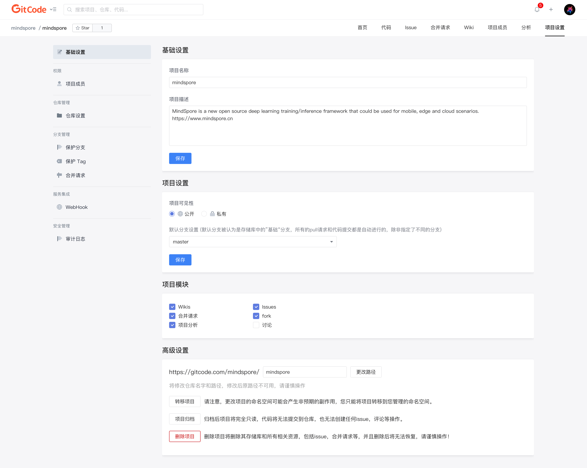

项目设置允许用户自定义项目的配置、权限、合并请求、部署以及其他重要属性。

### 进入项目设置

1. **登录 GitCode**：首先，请确保你已登录到 GitCode 帐户
2. **进入项目**：访问你要设置的项目页面
3. **点击”项目设置“**：在项目的导航中点击”项目设置“选项卡

### 配置项目设置

在项目设置页面，你可以配置以下设置：

- **基础设置**：包括项目名称、描述、默认分支、项目模块等配置，以及删除项目、转移项目等高级操作
- **项目成员**：管理项目成员列表
- **仓库设置**：配置分支、Tags限制等
- **保护分支**：设置特定分支的修改和推送操作进行限制，以保护重要分支的安全性和稳定性
- **保护 Tags**：设置创建特定 Tag 的行为进行限制，以保护此类 Tag 的安全性
- **合并请求**：设置合并请求的相关设置，包括合入条件、合并请求设置、合并模式等
- **Webhooks**：设置外部服务与项目的集成，以实现自动化操作
- **审计日志**：审计日志用于记录对项目仓库设置属性的更改

### 保存设置

在对项目的设置进行更改后，务必点击「保存」按钮来保存你的设置更改。